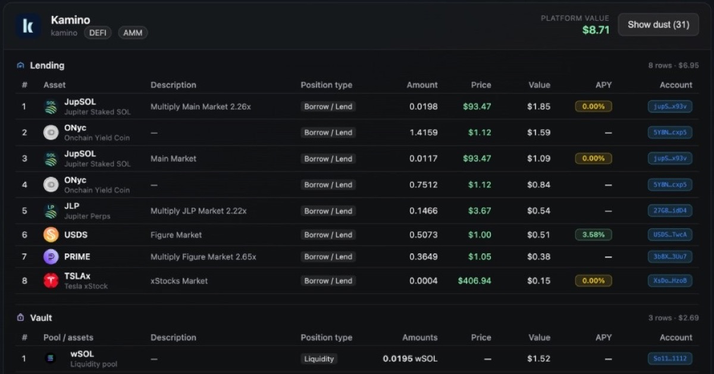

# Solana DeFi Positions API

<p align="center">

[](https://solana-defi-positions-api.vybenetwork.com)
[](https://github.com/vybenetwork/solana-defi-positions-api)
[](https://docs.vybenetwork.com/docs/positions-yields-staking)
[](https://docs.vybenetwork.com/reference/get_defi_accounts_v4_proxy)
[](https://docs.vybenetwork.com/reference/get_wallet_tokens_v4)
[](https://x.com/Vybe_Network)

[](https://t.me/VybeNetwork_Official)
</p>

**Solana DeFi Positions API:** Solana DeFi positions API for LPs, lending, staking & yield farming across 50+ protocols. SonarWatch alternative wallet tracker powered by the Vybe API. Use this project as a reference implementation or starter kit for portfolio trackers, DeFi dashboards, and protocol exposure UIs.

It includes a production-ready Node.js backend and a modern frontend that integrate Vybe’s DeFi positions and wallet token-balance endpoints—explore platform cards, position tables, APY badges, USD magnitude indicators, and symbol enrichment for LP / lending / staking rows.

Try the live demo: https://solana-defi-positions-api.vybenetwork.com



---

- **[Try the LIVE demo →](https://solana-defi-positions-api.vybenetwork.com)**
- **[Get your free Vybe API key →](https://vybe.fyi/api-pricing)**
- **[Positions (lending & LPs) guide →](https://docs.vybenetwork.com/docs/positions-yields-staking)**
- **[Realtime wallet balances guide →](https://docs.vybenetwork.com/docs/token-balances)**
- **[DeFi positions endpoint →](https://docs.vybenetwork.com/reference/get_defi_accounts_v4_proxy)**
- **[Wallet token balance endpoint →](https://docs.vybenetwork.com/reference/get_wallet_tokens_v4)**
- **[GitHub repo →](https://github.com/vybenetwork/solana-defi-positions-api)**
- **[Telegram →](https://t.me/VybeNetwork_Official)**
- **[X →](https://x.com/Vybe_Network)**

---

## Prerequisites

- **Node.js** ≥ 20 (LTS recommended)
- **npm** ≥ 10 (or equivalent)

## Quick Start

Get from clone to running app in a few commands:

```bash
git clone https://github.com/vybenetwork/solana-defi-positions-api.git
cd solana-defi-positions-api
npm install
cp .env.example .env
# Edit .env: set VYBE_DATA_API_KEY (required)
npm start
```

Then open **http://localhost:3001**, paste a Solana wallet address, and load DeFi positions. The UI groups LP, lending, staking, and yield positions by protocol with USD totals and optional wallet-balance context.

## Environment Variables

| Variable | Required | Description | Example |
|----------|----------|-------------|---------|
| `VYBE_DATA_API_KEY` | Yes | Key for wallets/tokens/DeFi (`VYBE_DATA_API_BASE`) | `your_api_key_here` |
| `VYBE_DATA_API_BASE` | No | Vybe data API base | `https://api.vybenetwork.xyz` |
| `HELIUS_API_KEY` | No | Helius RPC key (used when `SOLANA_RPC_URL` unset) | `your_helius_key` |
| `SOLANA_RPC_URL` | No | Full RPC URL override (wins over `HELIUS_API_KEY`) | `https://api.mainnet-beta.solana.com` |
| `PORT` | No | HTTP server port (default `3001`) | `3001` |
| `PROXY_HOST` + `PROXY_AUTH` | No | HTTP proxy for Jupiter / pump.fun enrichment | `geo.iproyal.com:12321` |
| `PUMPFUN_AUTH_TOKEN` | No | Optional pump.fun JWT | `your_jwt` |
| `HTTP_PROXY_POOL_SIZE` | No | Rotating proxy slot count | `10` |
| `HTTP_PROXY_WARMUP` | No | Warm Jupiter/pump.fun at startup | `true` |

Get your API keys at `https://vybe.fyi/api-pricing`.

---

## What This Repo Provides

- **DeFi positions + wallet balances proxy**
  - Express server that proxies / enriches Vybe:
    - `GET /v4/wallets/{ownerAddress}/defi-positions` (LP, lending, staking, yield across protocols)
    - `GET /v4/wallets/{ownerAddress}/token-balance` (wallet holdings alongside DeFi exposure)
    - `GET /v4/tokens/{mintAddress}` (token metadata + price fields for symbol enrichment)
- **Symbol enrichment**
  - Hydrates missing pool/asset symbols from disk cache + sequential Vybe/Jupiter/pump.fun enrichment.
- **DeFi positions web UI**
  - Single-page GUI (no frameworks) in `public/` — category cards, platform sections, position tables, APY badges, USD magnitude bars, and related-demo links.

---

### Solana API docs for these endpoints

- **Positions / lending & LPs (guides)**:
  - [https://docs.vybenetwork.com/docs/positions-yields-staking](https://docs.vybenetwork.com/docs/positions-yields-staking)
- **Realtime wallet balances (guides)**:
  - [https://docs.vybenetwork.com/docs/token-balances](https://docs.vybenetwork.com/docs/token-balances)
- **DeFi positions (`GET /v4/wallets/{ownerAddress}/defi-positions`)**:
  - [https://docs.vybenetwork.com/reference/get_defi_accounts_v4_proxy](https://docs.vybenetwork.com/reference/get_defi_accounts_v4_proxy)
- **Wallet token balance (`GET /v4/wallets/{ownerAddress}/token-balance`)**:
  - [https://docs.vybenetwork.com/reference/get_wallet_tokens_v4](https://docs.vybenetwork.com/reference/get_wallet_tokens_v4)
- **Token details (`GET /v4/tokens/{mintAddress}`)**:
  - [https://docs.vybenetwork.com/reference/get_token_details_v4](https://docs.vybenetwork.com/reference/get_token_details_v4)
- **Token trade history (`GET /v4/trades`)**:
  - [https://docs.vybenetwork.com/reference/get_trade_data_program_v4](https://docs.vybenetwork.com/reference/get_trade_data_program_v4)
- **Labeled programs (`GET /v4/programs/labeled-program-accounts`)**:
  - [https://docs.vybenetwork.com/reference/get_known_program_accounts_v4](https://docs.vybenetwork.com/reference/get_known_program_accounts_v4)

---

## Why DeFi Position APIs Matter

DeFi position APIs are critical for:

- **Portfolio trackers**: show LP, lending, and staking exposure beyond liquid wallet balances.
- **Protocol risk views**: group positions by platform and category with USD totals.
- **Yield surfaces**: surface APY when available and call out missing / zero APY clearly.
- **Enrichment**: resolve pool asset symbols and logos for readable tables.

This repo shows how to build a **practical DeFi positions explorer** on top of Vybe’s wallet DeFi and token endpoints.

---

## Server Proxy Routes

The Express server in `src/server.ts` exposes:

- **`GET /api/wallets/:ownerAddress/defi-positions`**
  - LP / lending / staking / yield positions with optional symbol enrichment.
- **`GET /api/wallets/:ownerAddress/token-balances`**
  - Query: `limit`, `stream`, `enrich`, `enrichLimit` — wallet SPL holdings.
- **`GET /api/token/:mint`**
  - Resolve token metadata and USD price for a single mint.
- **`GET /health`**
  - Service status and configured backends.
- **`GET /cached/token-icons/*`**
  - Cached token icon assets.

All Vybe requests use a shared client (`src/api/client.ts`) with timeouts, retries, and human-readable errors (`toHumanReadableError`).

---

## npm Scripts

| Script | Description |
|--------|-------------|
| `npm start` / `npm run dev` | Run Express server (`tsx src/server.ts`) |
| `npm run build` | Compile TypeScript → `dist/` |
| `npm run typecheck` | Typecheck without emit |
| `npm run dump:vybe-wallet` | Dump raw Vybe wallet token-balance for a wallet |
| `npm run deploy:vm` / `npm run redeploy:vm` | Production VM deploy helpers |

---

## How to Run

### 1. Clone the repository

```bash
git clone https://github.com/vybenetwork/solana-defi-positions-api.git
cd solana-defi-positions-api
```

### 2. Install dependencies

```bash
npm install
```

### 3. Set your API key

```bash
cp .env.example .env
# Set VYBE_DATA_API_KEY
```

### 4. Run the server + web app

```bash
npm start
```

Then open **http://localhost:3001**. Paste a wallet address and load DeFi positions to inspect protocol cards, position rows, and USD totals.

---

## Project Structure

```text
solana-defi-positions-api/
├── .env.example           # Copy to .env — VYBE_DATA_API_KEY, optional HELIUS / RPC / proxy
├── package.json
├── README.md
├── screenshots/           # Screenshots referenced in this README
├── public/                # Web GUI (HTML, CSS, JS)
│   ├── index.html
│   ├── app.css
│   ├── app.js
│   ├── defi-positions.js
│   ├── solana-defi-positions-api.jpg
│   └── …
├── tools/                 # Dump / benchmark helpers
└── src/
    ├── server.ts          # Express server; proxies Vybe API and serves public/
    ├── config.ts
    ├── token-icon-cache.ts
    ├── types/
    └── api/
        ├── client.ts
        ├── wallet-defi-positions.ts
        ├── wallet-balance.ts
        ├── enrich-defi-symbols.ts
        ├── hydrate-defi-symbols.ts
        ├── tokens.ts
        ├── resolve-token-meta.ts
        └── …
```

---

## Direct API Usage Example

```typescript
const base = 'http://localhost:3001';
const owner = 'YOUR_WALLET_PUBKEY';

const res = await fetch(`${base}/api/wallets/${owner}/defi-positions`);
const positions = await res.json();
console.log(positions);
```

Or call Vybe directly:

```typescript
import axios from 'axios';

const API = 'https://api.vybenetwork.xyz';
const headers = { 'X-API-KEY': process.env.VYBE_DATA_API_KEY!, Accept: 'application/json' };

async function fetchDefiPositions(ownerAddress: string) {
  const { data } = await axios.get(`${API}/v4/wallets/${ownerAddress}/defi-positions`, {
    headers,
  });
  return data;
}
```

---

## Troubleshooting

| Issue | What to do |
|-------|------------|
| **403 Forbidden** | Verify `VYBE_DATA_API_KEY` in `.env` is correct and has wallet/DeFi access. |
| **Empty positions** | Confirm the wallet has LP/lending/staking exposure; the DeFi route is beta and coverage varies by protocol. |
| **Missing symbols / logos** | Allow enrichment to finish; check proxy env if Jupiter/pump.fun outbound calls are blocked. |
| **Slow responses / timeouts** | Retry later or load wallet balances separately with a lower `limit`. |
| **Missing env vars** | Ensure you copied `.env.example` to `.env` and set `VYBE_DATA_API_KEY`. |

---

## Support

- **Telegram:** [VybeNetwork Official](https://t.me/VybeNetwork_Official)
- **X:** [@Vybe_Network](https://x.com/Vybe_Network)
- **GitHub:** [solana-defi-positions-api](https://github.com/vybenetwork/solana-defi-positions-api)
- **Support ticket:** [Submit a ticket via vybenetwork.com](https://vybenetwork.com)
